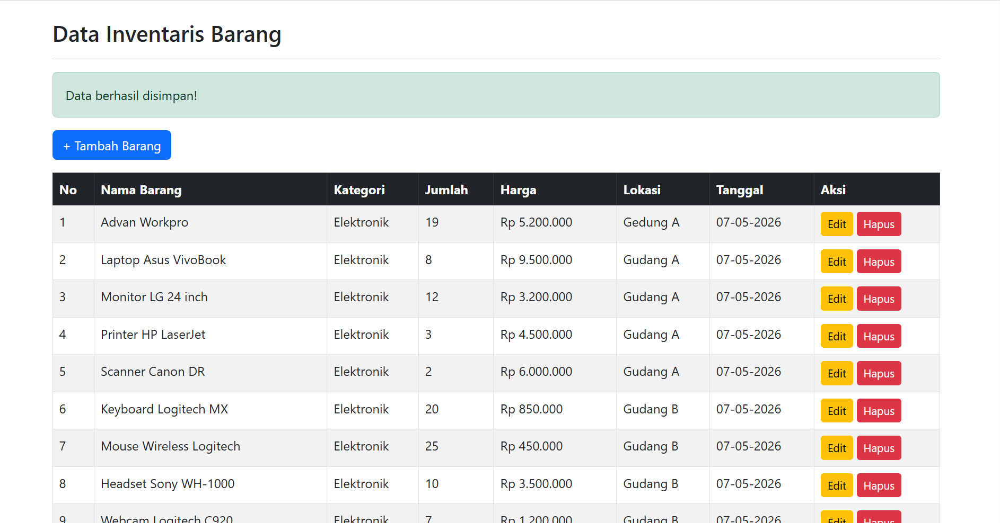
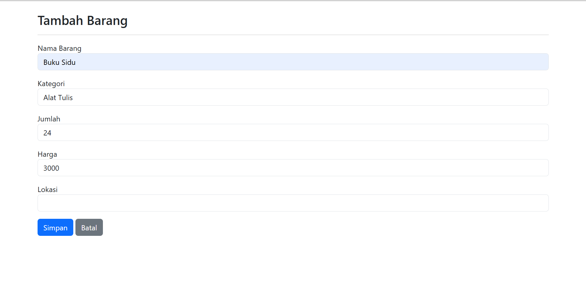
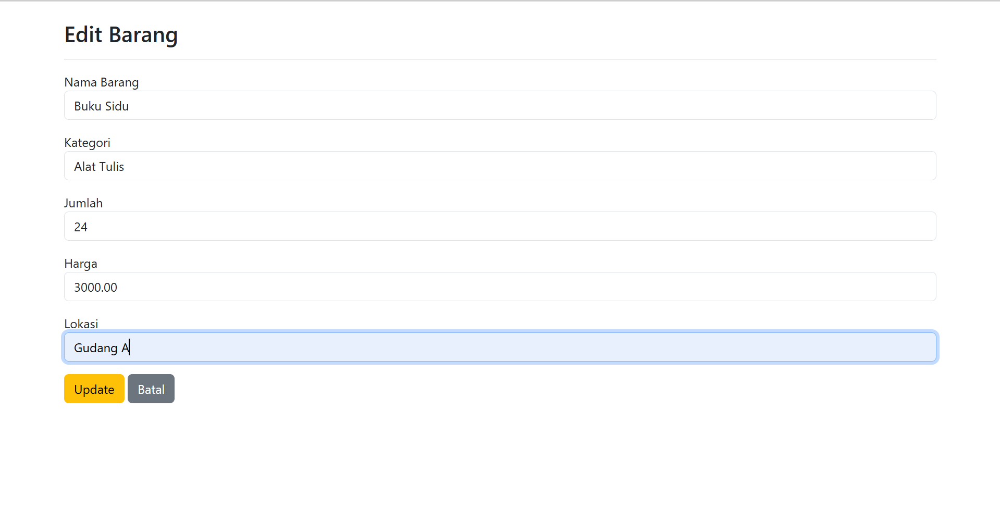
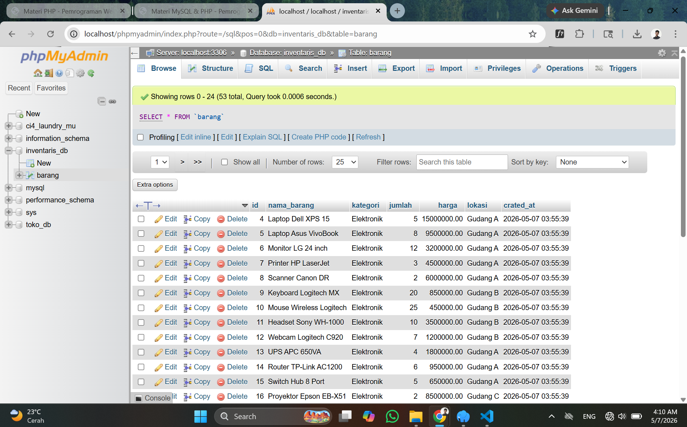

# T4-weel10 - Aplikasi CRUD PHP MySQL

Nama    : M. Sagos
NIM     : F1D02410070
Kelas   : Pemrograman Web

## Deskripsi
Aplikasi CRUD(Create, Read, Update, Delete) menggunakan PHP, MySql, dan Bootstrap.

- Database  : inventaris_db
- Tabel     : barang

## Cara Menjalankan
1. Import file .sql ke phpMyAdmin
2. Letakkan folder prject di htdocs/ (XAMPP)
3. Buka browser ke http://localhost/T4-week10/

## Screenshot

### Daftar Data

### Tambah Data

### Edit Data

### Struktur Database

